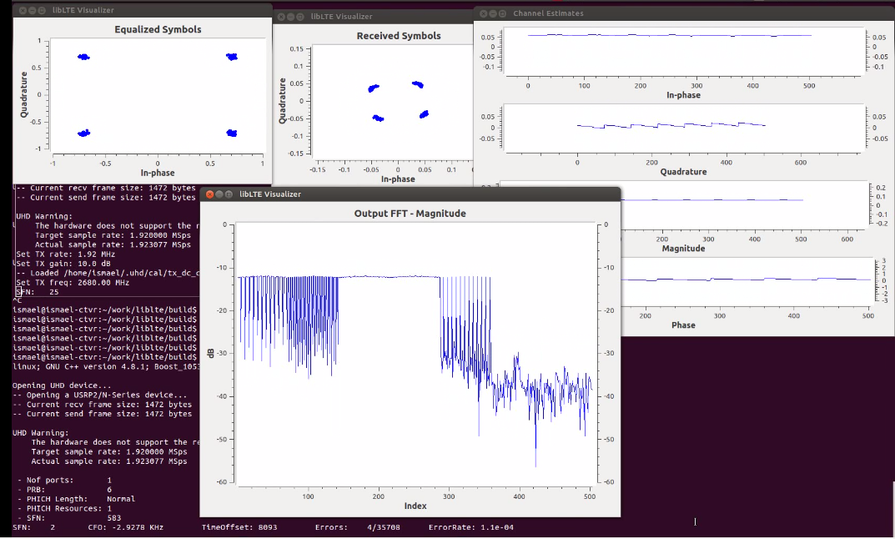

srsLTE
========

[](https://scan.coverity.com/projects/10045)

srsLTE is a free and open-source LTE library for SDR UE and eNodeB developed by SRS (www.softwareradiosystems.com). The library is highly modular with minimum inter-module or external dependencies. It is entirely written in C and, if available in the system, uses the acceleration library VOLK distributed in GNURadio. 

**srsLTE is used by srsUE, a full stack (PHY to IP) implementation of an LTE UE. srsUE is available at https://github.com/srslte/srsue**   


The srsLTE software license is AGPLv3.

Current Features: 
 * LTE Release 8 compliant
 * FDD configuration
 * Tested bandwidths: 1.4, 3, 5, 10, 15 and 20 MHz
 * Transmission mode 1 (single antenna) and 2 (transmit diversity) 
 * Cell search and synchronization procedure for the UE
 * All DL channels/signals are supported for UE and eNodeB side: PSS, SSS, PBCH, PCFICH, PHICH, PDCCH, PDSCH
 * All UL channels/signals are supported for UE side: PRACH, PUSCH, PUCCH, SRS 
 * Frequency-based ZF and MMSE equalizer
 * Highly optimized Turbo Decoder available in Intel SSE4.1/AVX (+100 Mbps) and standard C (+25 Mbps)
 * MATLAB and OCTAVE MEX library generation for many components
 * UE receiver tested and verified with Amarisoft LTE 100 eNodeB and commercial LTE networks (Telefonica Spain, Three.ie and Eircom in Ireland)

Missing Features: 
 * Closed-loop power control 
 * Semi-Persistent Scheduling

Hardware
========

The library currently supports the Ettus Universal Hardware Driver (UHD) and the bladeRF driver. Thus, any hardware supported by UHD or bladeRF can be used. There is no sampling rate conversion, therefore the hardware should support 30.72 MHz clock in order to work correctly with LTE sampling frequencies and decode signals from live LTE base stations. 

We have tested the following hardware: 
 * USRP B210
 * USRP X300
 * bladeRF

Download & Install Instructions
=================================

* Mandatory dependencies: 
  * libfftw
* Optional requirements: 
  * srsgui:        for real-time plotting. Download it here: https://github.com/srslte/srsgui 
  * VOLK:          if the VOLK library and headers are detected, they will be used for accelerating some signal processing functions. 
  * Matlab/Octave: if found by CMake, MEX files will also be generated and installed. If you find any compilation issue with MEX and you don't need them, pass -DDisableMEX=ON to cmake to disable them. 

Download and build srsLTE: 
```
git clone https://github.com/srsLTE/srsLTE.git
cd srsLTE
mkdir build
cd build
cmake ../
make 
```

The library can also be installed using the command ```sudo make install```. 

Running srsLTE Examples
========================

* SIB1 reception and UE measurement from commercial LTE networks: 
```
lte/examples/pdsch_ue -f [frequency_in_Hz]
```
Where -f is the LTE channel frequency. 

* eNodeB to UE Downlink PHY test

You will need two computers, each equipped with a USRP. At the transmitter side, run: 

```
lte/examples/pdsch_enodeb -f [frequency_in_Hz] [-h for more commands]
```

At the receiver run:
```
lte/examples/pdsch_ue -r 1234 -f [frequency_in_Hz]
```

At the transmitter console, it is possible to change the Modulation and Coding Scheme (MCS) by typing a new number (between 0 and 28) and pressing Enter. 


The output at the receiver should look something similar to the following video. In this example, we removed the transmitter and receiver antennas in the middle of the demonstration, showing how reception is still possible (despite with some erros). 

https://www.dropbox.com/s/txh1nuzdb0igq5n/demo_pbch.ogv



* Video over Downlink PHY (eNodeB to UE)

The previous example sends random bits to the UE. It is possible to open a TCP socket and stream video over the LTE PHY DL wireless connection. At the transmitter side, run the following command:  

```
lte/examples/pdsch_enodeb -f [frequency_in_Hz] -u 2000 [-h for more commands]
```

The argument -u 2000 will open port 2000 for listening for TCP connections. Set a high-order MCS, like 16 by typing 16 in the eNodeB console and pressing Enter. 

```
lte/examples/pdsch_ue -r 1234 -u 2001 -U 127.0.0.1 -f [frequency_in_Hz]
```

The arguments -u 2001 -U 127.0.0.1 will forward the data that was injected at the eNodeB to address:port indicated by the argument. Once you have the system running, you can transmit some useful data, like a video stream. At the transmitter side, run:  

```
avconv -f video4linux2 -i /dev/video0 -c:v mp4 -f mpegts tcp://127.0.0.1:2000 
```
to stream the video captured from the webcam throught the local host port 2000. At the receiver, run: 

```
avplay tcp://127.0.0.1:2001?listen -analyzeduration 100 -loglevel verbose
```
to watch the video. 

Support
========

Mailing list: http://www.softwareradiosystems.com/mailman/listinfo/srslte-users
