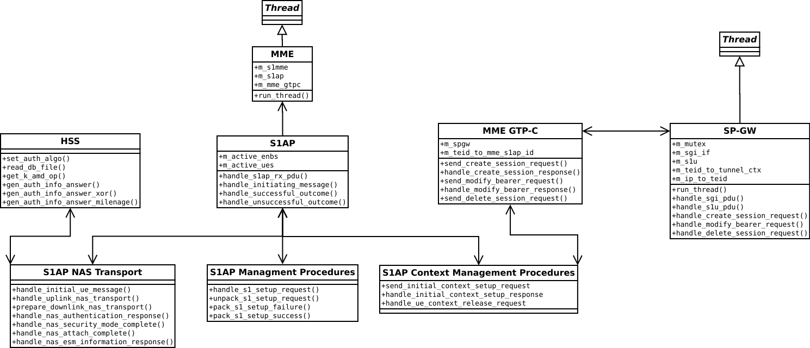

EPC Design
==========

Code Structure
**************

The LTE library should include the following functionality that will be common accress multiple nodes.

.. _epc-overall:

   EPC overall class architecture

MME Design
**********

The srsMME must maintain three EPC interfaces, the S1-MME, the S11 and the S6a interfaces. The S1-MME will use an SCTP (many-to-one) socket and the S11 will use the GTP-Cv2 protocol over UDP. The S6a will be implmented as a Diameter application over UDP.

The main loop of the MME will  

HSS Design
**********

SP-GW Design
***********

