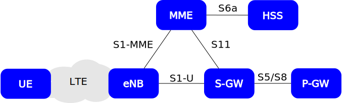
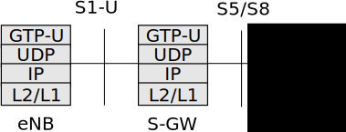

EPC Overview
============

The Evolved Packet Core (EPC) refers to the elements of an LTE network that make up the core of the network. The main functionality of these elements is to provide data conectivity, mobility and user authentification.

:ref:`epc-overall` illustrates the main components and their interfaces in the EPC.

.. _epc-overall:

   EPC overall architecture

* *HSS*: The Home Subscriber Service (HSS) is the user database. It stores information such as the user's id, key, usage limits, etc. It is responsible for authenticating an authorizing the user's access to the network.

* *MME*: Mobility Managment Entity (MME) is the main control element in the network. It handles mobility and attach control messages. It is also responsible for paging UEs in idle mode.  

* *S-GW*: The S-GW is the main dataplane gateway for the users, as it provides the mobility anchor for the UEs. It works as an IP router and helps setting up GTP sessions between the eNB and the P-GW.

* *P-GW*: The Packet Gateway (P-GW) is the point of contact with external networks. It enforces the QoS parameters for subscriber sessions.

EPC User and Control Plane
************************** 

In this subsection, we will breifly describe the EPC's user and control plane. The user plane, uses the GPRS Tunneling Protocol to estabilish tunnels between the P-GW and the eNB. The GTP is a IP-over-IP protocol, that encapsulates user packets in another IP packet plus a label to provide mobility. To see a more detailed description of GTP, go to :ref:`gtp-section`. 

These user plane tunnels are set up between the eNB, the S-GW and the P-GW over the S1-U and S5/S8 interfaces. The full protocol stack is illustrated in :ref:`epc-user-plane`. 
  
.. _epc-user-plane:

   EPC User Plane (S1-U and S5/S8)

To establish these user tunnels, the GTP-Cv2 protocol and the S1-APP protocol are used. These protocols provide the interfaces between the eNB, the MME, the S-PGW and the P-GW. The full protocol stack can be seen in :ref:`epc-control-plane`. The details of the GTP-Cv2 and S1-APP can be seen in :ref:`gtp-section` and :ref:`s1app-section`, respectively.

.. _epc-control-plane:

.. figure:: _imgs/epc-control-plane.svg

   EPC Control Plane (S1-MME, S11 and S5/S8)

Finally, to authenticate the user and authorize him or her, the MME comunicates with the HSS over the S6a interface. This interface will run the Diameter protocol the exchange user authentification and authorization information, as seen in :ref:`epc-auth-plane`. More details on :ref:`diameter-section`

.. _epc-auth-plane:

.. figure:: _imgs/epc-auth-plane.svg

   EPC Authentication Plane (S6a)

Procedures
**********

In this section we will generally describe the most relevant procedures and their implementation status. This will be more of an higher layer view, as the details of each message passed will be elaborated on the :ref:`s1app-section`, :ref:`gtp-section` and :ref:`diameter-section` sections. 

UE Attach proceedure
++++++++++++++++++++

The UE attach procedure is one of the first and most crucial steps for the UE to get connectivity. For this reason, this is the first procedure to be described. This can be broken down to multiple procedures and you can see bellow

.. seqdiag::

   seqdiag {

     === Random Access Procedure ===
     UE  <- eNB [label = "MIB"]
     UE  <- eNB [label = "SIB1"]
     UE  <- eNB [label = "SIB2"]
     UE  -> eNB [label = "Random Access Preamble"];
     UE  <- eNB [label = "Random Access Response [Tmp C-RNTI]"];
     UE  -> eNB [label = "RRC Connection Request [Tmp C-RNTI]"];
     UE  <- eNB [label = "RRC Connection Setup [C-RNTI]"];
     UE  -> eNB [label = "RRC Connection Completed [Attach Request (IMSI), PDN Connection Request]"];
     === User Authentication Procedure ===
            eNB  -> MME [label = "Initial UE Msg [Attach Request, PDN Connection Request]"];
                    MME -> HSS [label = "Auth Info Request (IMSI)"];
                    MME <- HSS [label = "Auth Info Answer (Kasme, AUTN, RAND, XRES)"]
            eNB  <- MME [label = "DL NAS Xport [Authn Request]"];
     UE  <- eNB [label = "DL Info Xfer [Auth Request (AUTN, RAND)]"];
     UE  -> eNB [label = "Auth Response (RES)"];
            eNB  -> MME [label = "Auth Response (RES)", note = "MME compares RES with XRES"];
     === NAS Security Setup Procedure ===
            eNB  <- MME [label = "DL NAS Xport [Security Mode Command]"];
     UE  <- eNB [label = "DL Info Xfer [Security Mode Command]"];
     UE  -> eNB [label = "Security Mode Complete"]
            eNB  -> MME [label = "SMC Completed"]
     === Authorization ===
                    MME  -> HSS [label = "Location Update Request (IMSI)"]
                    MME  <- HSS [label = "Location Update Response (Subscription Data)"]
     === GTP Tunnel setup ===
                    MME  -> SGW [label = "Create Session Request (IMSI, TEID, PGW IP)"]
                            SGW  -> PGW [label = "Create Session Request (IMSI, TEID)"]
                            SGW  <- PGW [label = "Create Session Response (TEIDs)", note = "S5 GTP Tunnel created"]
                    MME  <- SGW [label = "Create Session Response (TEIDs)"]
            eNB  <- MME [label = "Initial Context Setup Request (UE Context Info, TEID)", note="NAS Attach Accept, NAS Activate default bearer"]
     UE  <- eNB [label = "RRC Security Mode Command (AS Algorithm)"]
     UE  -> eNB [label = "RRC Security Mode Complete"]
     //UE  <-> eNB [label = "UE Radio Capabilities"]    
     UE  <- eNB [label = "RRC Connection Reconfiguration", note = "NAS Attach Accept, NAS Activate Default Bearer"]
     UE  -> eNB [label = "RRC Reconfiguration Complete"]
            eNB -> MME [label = "Initial Context Setup Complete (S1U TIED)"]
     UE  -> eNB [label = "Uplink Information Transfer [NAS Attach Complete, NAS Activate default bearer accept]"]
            eNB -> MME [label = "Uplink NAS Xport [NAS Attach Complete, NAS Activate default bearer accept]"]
                   MME -> SGW [label = "Modify bearer request (S1-U TEID)"]
                   MME <- SGW [label = "Modify bearer response"]
     === Networking Setup === 
   }

.. _gtp-section:

GPRS Tunneling Protocol
***********************

The GPRS Tunneling Protocol (GTP) main objective is to tunnel IP packets to the UE, allowing him to keep his IP even when the user is mobile.
It is composed of two parts, the user plane and the control plane.

Transport Layer
+++++++++++++++

Both GTP-C and GTP-U use UDP for the transport layer. The specific port for GTP-C TX and RX is 2123. For GTP-U packets must have a destination port of 2152, but can use any source port. 

Setting up TEIDs
++++++++++++++++

In this section we will describe the setup of GTP tunnels, both between the S-GW and P-GW and between the S-GW and the eNB. 
We will start with the setup of the of GTP tunnels between the S-GW and the P-GW for simplicity. 

Initially, the S-GW sends a message to TEID 0 (the butler tunnel) saying that it wants to set up a GTP-U tunnel. This should include the IMSI of the user, the IP address of the S-GW, control plane TEID_sgw_d, user plane TEID_sgw_d,

The P-GW replies with the with the Create Session Response message, that contains the control TEID_pgw_u that the P-GW allocated for signaling messages for that UE. It will also send the P-GWs IP address and user TEID_pgw_u for uplink user traffic. After this, the TEID tunnels are set up between the S-GW and the P-GW.

For the set up of GTP-U tunnels between the eNB and the S-GW the process is similar, but the S1-MME (which uses S1-APP instead of GTP-C) must be used. This procedure is initiated by the MME requesting a GTP-U tunnel on behalf of the eNB, by sending a Create Session Request to the S-GW. The S-GW will create a tunnel between himself and the P-GW and after that it will reply to the MME. The MME will finally relay the information of the IP of the S-GW and the TEIDs to the eNB in the Initial Context Setup Request message.

The whole process is illustrated below:

.. seqdiag::

   seqdiag {
     activation = none;
     MME -> S-GW [label = "Create Session Request"];
            S-GW -> P-GW [label = "Create Session Request"]
            S-GW <- P-GW [label = "Create Session Response"];
     MME <- S-GW [label = "Create Session Response"];
     eNB <- MME [label = "Initial Context Setup"];
   }

.. _s1app-section:

S1-APP
******

In this section, we will describe the S1-APP protocol. The S1-APP will run over SCTP and the eNB will initiate the assotiation using the destination port 36412.

This protocol involved in of multiple procedures, such as S1-MME Setup, UE attach, paging etc.
As this protocol is quite large, we will focus on the procedures we consider most relevant.

The following sub-sections describe these procedures and give some small indication of their implementation status:

* :ref:`s1-setup`
* :ref:`erab-setup-request`

.. _s1-setup:

S1 Setup
++++++++++

This is the first procedure between the eNB and the MME, started once the transport layer is active, to setup the S1-MME connection.
After this procedure takes place, both nodes will store the information exchanged. If the information is already present, it is erased and updated with the most recent information exchanged.

In this procedure, the following information is sent to the MME from the eNB:

* *eNB Id*             (M): This field will be the global eNB Id; 
* *eNB Name*           (O): This field will include the human readable name of the eNB;
* *Supported TA*       (M): This field will include the 
* *Default Paging DRX* (M): This message
* *CSG List Ids*       (O): This

In the case of success, the MME will reply the following:

* *MME Name*              (O): This message will include the human readable name of the MME;
* *Served GUMMEI*         (M): This field will contain the Globally Unique MME Id. This is composed by the MCC, MNC, MME Group Id and MME code.
* *Relative MME Capacity* (M): This message will contain a weight factor for MME load balancing purposes
* *Criticality Diagnosis*          (O): This field indicates if some IE were not understood by the MME or missing

In the case of failure, the MME will reply the following:

* *Cause Id*              (M): This message will what was the cause for the setup failure;
* *Time to wait*          (O): This will indicate the eNB to wait at least the indicated amount of time before restarting the S1 Setup
* *Criticality Diagnosis* (O): This field indicates if some IE were not understood by the MME or missing

You can see the message diagram for both the success and failure case below:

.. _success-s1-setup:

.. seqdiag::

   seqdiag {
     activation = none;
     eNB -> MME [label = "S1 Setup Request"];
     eNB <- MME [label = "S1 Setup Response"];
   }

.. _fail-s1-setup:

.. seqdiag::

   seqdiag {
     activation = none;
     eNB -> MME [label = "S1 Setup Request"]
     eNB <- MME [label = "S1 Setup Failure"]
   }

.. _erab-setup-request:

E-RAB Setup Request
+++++++++++++++++++

.. _diameter-section:

Diameter
********

